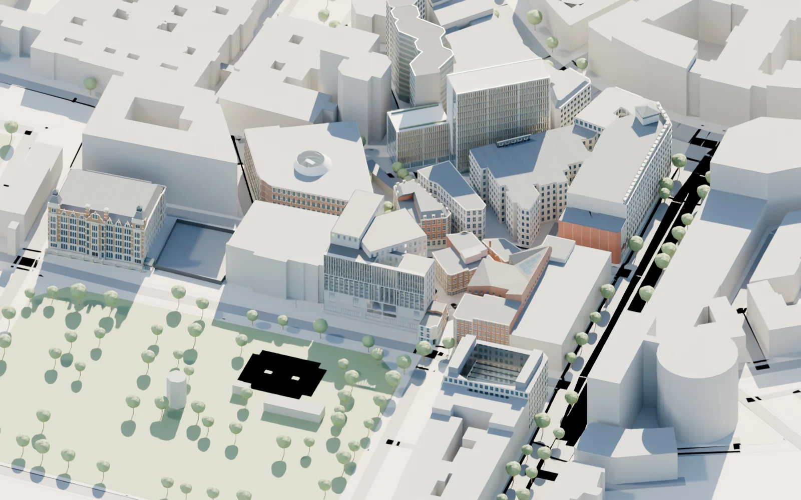

# LSEmap

A browser-based exploration of the London School of Economics campus, built from
an independent Blender architectural study.



Explore the campus by orbiting, panning and zooming. Select a building directly or
search by its name/code. Detail panels open original model renderings, and five
public-interior studies load on demand. The interface supports mobile screens,
keyboard navigation, reduced motion, shareable building links and a gallery
fallback when WebGL is unavailable.

## Local preview

Requires Node.js 22.12 or newer.

```sh
npm ci
npm run dev
```

For the production build:

```sh
npm run build
npm run preview
```

## Cloudflare

The site is static, with no server, API key or external asset CDN. All runtime
models, images and decoders are included in `dist` after building.

**Cloudflare Pages with GitHub integration**

| Setting | Value |
|---|---|
| Repository | `Haoran-Xu-0316/LSEmap` |
| Production branch | `main` |
| Root directory | repository root |
| Build command | `npm run build` |
| Build output directory | `dist` |
| Node version | `22` or newer |

Alternatively, build locally and upload the contents of `dist` through Pages
Direct Upload. Upload the build output, not the repository or the Blender archive.

**Cloudflare Workers static assets**

The included `wrangler.jsonc` points to `dist`. After building, an authenticated
Wrangler installation can deploy that configuration. No deployment is performed
by the build command.

Every asset is checked against Cloudflare Pages’ 25MiB per-file limit:
[Cloudflare Pages limits](https://developers.cloudflare.com/pages/platform/limits/).

## Project layout

- `web/index.html`: accessible application shell and project information.
- `web/src/`: rendering, camera interaction, UI state, building copy and styling.
- `web/public/models/`: compressed campus, interior models and building catalogue.
- `web/public/images/`: web-optimized model renderings.
- `web/public/draco/`: self-hosted Draco decoder.
- `web/tools/`: asset checks and optional Blender export/render scripts.
- `web/tests/`: browser acceptance checks.

The existing local research archive remains under `data`, `code` and `result`.
It includes reference photographs, PDFs, the data-index `main.py`, editable Blender
files and intermediate evidence. Those files are intentionally excluded from this
public web repository. A fresh clone can build and run the website without them.
The optional export scripts need that local archive and are run inside Blender's
Text Editor; their source paths are relative to the project root.

## Validation

```sh
npm run check
npm run build
npx playwright install chromium
npm test
```

Tests cover desktop/mobile selection, search and empty results, gallery navigation,
public-interior switching, unknown footprints, deep links, keyboard/reduced-motion
behavior and recovery after a model network failure. On macOS the browser tests use
ANGLE Metal; the default headless software renderer may not create a WebGL context.

## Model scope and attribution

The catalogue contains 31 official map-code records, not 31 independent finished
buildings. Twelve have developed exterior details; 5LF and 49L remain unresolved,
61A has provisional attribution, and 35L is represented as a construction site.
Most dimensions are photo-based estimates. This is not a measured survey, a live
campus map or a route planner. The project has no official affiliation with LSE.

Web models simplify small bevels and procedural materials. High-detail renderings
retain more of the Blender finishes. The OLD photographic relief reference is
removed from the public model and its public rendering.

Footprints: ©[OpenStreetMap contributors](https://www.openstreetmap.org/copyright),
ODbL 1.0. See [asset credits](web/public/credits.txt) for source institutions,
model limitations and software licenses. Reference photos/PDFs are not redistributed.
