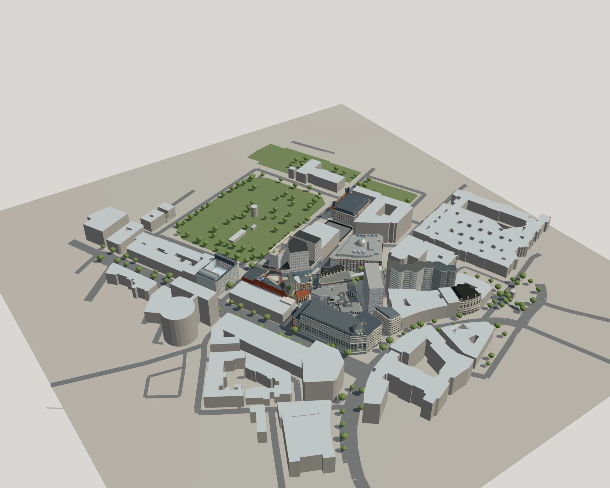

# LSEmap

A browser-based exploration of the London School of Economics campus, built from
an independent Blender architectural study.

[Explore the live campus](https://lsemap.xhr0316.workers.dev/)



Explore the campus by orbiting, panning and zooming. Select a building directly or
search by its name/code. Detail panels open renderings from the same production viewer, and thirty-two
interior studies load on demand across twenty-five buildings: five public spaces and twenty-seven room samples. The interface supports mobile screens,
keyboard navigation, reduced motion, shareable building links and a gallery
fallback when WebGL is unavailable. Thirty building models and thirty-two interior
views progressively load native bevels and source-derived procedural materials.
The lightweight campus remains available while these assets download.
Fixed-name campus and interior downloads carry the catalogue source revision, so
returning visitors cannot combine a new catalogue with an older cached model.

Edition 08 locates Coopers (49L) and corrects the adjoining 50/50A envelope using
Rock Townsend’s 2022 block plan. A prior 50L footprint occupied the restaurant
corner; the two street studies now have separate, non-overlapping envelopes.
Coordinates are registered to the existing OCS outline and remain approximate.

Edition 07 develops the provisional 61A envelope with stone window bays, tall
pilasters, a recessed corner entrance, roof dormers and a hipped pavilion.
Its independent footprint attribution remains provisional; the reference is an
archived pre-redevelopment photograph, not a proposed LSE redesign.

Edition 06 adds the independently attributed 5LF townhouse, with sash windows,
a rusticated ground floor, entrance steps, forecourt railings and chimney stacks.
The official LSE address-map point falls inside OSM way/1184094775.
Heights and unseen elevations remain estimated.

Edition 05 adds first-pass street facades for COW, KGS, LAK, LCH, 50L, 51L, PAR,
PEA, PEL, POR, SAR, SHF and STC. Brickwork, sash windows, stone courses and
building-specific entrances replace generic envelopes. Cowdray gains a mansard
roof and dormers; Peacock gains its canopy and vertical theatre sign. These thirteen
studies are labeled separately from the fourteen previously detailed buildings.
Heights, window spacing, unseen elevations and roof depth remain approximate.
The LSE mark comes from the existing personal-site vector asset, with no affiliation
or endorsement implied.

Columbia and Connaught also include an **入口细节** camera preset for close inspection.
Isolated views hide other building labels and exclude hidden geometry from selection.

## Edition 122 Lincoln and Portsmouth street details

No.50's photographed entrance window now has three columns and two rows, and
its stone arch has a curved internal return. Ten glazing probes remain clear.
No.51's street base gains eight ashlar courses with225 jointed face pieces while
retaining its three arches; nine masonry-clearance probes pass. Portsmouth's six
paired side sashes and two upper chamfer windows follow the estate photograph's
distinct glazing patterns;32 probes first reach glass.

Ten owned component objects retain the originals and leave all interior studies
unchanged. Unseen sash patterns, total No.50 bay count, roof dimensions and complete
interiors remain unresolved. Photographs are historical or undated; this edition
does not claim a measured current-condition survey.

## Edition 121 window and roof corrections

Lakatos dormer openings now cut through the sloped roof instead of being sealed
by it. All24 sampled roof-window rays reach glass; the retained roof outline,
bay counts and dimensions remain estimates. Sheffield Street's19 street windows
now use six paired lights, with narrow overlights and three lower rows in tall
sashes. Its upper timber-door glazing has12 unobstructed aperture samples.
The official estate photographs support these visible patterns; unseen elevations
and the existing interior studies have not been reconstructed anew.

Eleven isolated component objects are merged without changing original meshes,
transforms or material slots. Overview and close-up exports retain the same new
joinery and roof geometry. Fawcett's independent facade and roof remain unresolved:
the available official photograph shows the shared Pankhurst entrance.

## Edition 120 parallel exterior corrections

King’s Chambers now has green ceramic cladding on the street-facing attic and
lead-coloured cupola seams, supported by the
[listed-building description](https://historicengland.org.uk/listing/the-list/list-entry/1235528)
and LSE estate photograph. Parish Hall gains radial brick joints around its four
pointed window heads and pale timber joinery, following the
[2015 refurbishment record](https://info.lse.ac.uk/staff/divisions/estates-division/Assets/Documents/Cap-Dev/2015-Parish-Hall.pdf).
Nineteen isolated component objects are merged with the edition119 Sardinia
frontage. Original objects remain archived without geometry or material-slot
changes. KGS passes 28 attic-glazing probes; PAR passes 8 before/after aperture
checks. Exact pigments and brick-joint dimensions remain estimates; this does
not correct every elevation, roof or complete interior.

## Edition 119 Sardinia street frontage

Sardinia House now has five street bays and a central stone entrance, replacing
an eight-bay generic frontage. Dark ground-floor joinery, broad pale mezzanine
windows, alternating triangular and segmental pediments, recessed brick courses,
jack arches and the hanging name sign follow
[2017](https://commons.wikimedia.org/wiki/File:Sardinia_House,_Sardinia_Street_7_Jan_2017_03.jpg)
and [2022 photographs](https://commons.wikimedia.org/wiki/File:Sardinia_House,_London,_March_2022.jpg),
checked against the official property handbook. The adjoining three-bay property
is excluded. The [access guide](https://www.accessable.co.uk/london-school-of-economics/access-guides/sardinia-house)
records a 120cm doorway and five steps beyond the entrance; no external stairs
have been inferred from that description.

The saved model passes thirty clear-aperture probes. Original geometry and the
roof remain intact; height, window dimensions, colour and pane subdivisions are
estimates. These historical photographs do not establish a 2026 survey or full
interior plan. The separate 2015 tea-room sample remains unchanged.

## Edition 118 Cowdray corner portal

Cowdray's corner entry now has three steps, paired dark timber doors with actual
glazing apertures, an arched transom, reeded pilasters and layered stone cornices.
The [entrance guide](https://www.accessable.co.uk/london-school-of-economics/access-guides/cowdray-house)
records three external steps and a 73cm active opening; the nominal paired width,
15cm risers, treads and carved profiles remain photo-guided estimates.
[Contractor photographs](https://www.russellcawberry.com/projects/cowdray-house)
refer to a 2019 project with an unverified capture date. Relief details are authored
approximations, not scans. Roof geometry, upper-window joinery and the independent
historic seminar-room sample are retained; this does not establish a full interior.

The saved scene passes seven clear-glazing probes and all three step-height probes.
Rebuilding from the current file reproduces 47 visible Cowdray meshes, materials
and UVs. The overview, selected building and entrance gallery use the same portal;
the close-up now includes the complete entry and stairs.

## Edition 117 library street facade

Carey Street now has five semicircular glazed heads, three storeys of projecting
triple-light oriels, distinct ground-floor service and glazed openings, and a
continuous curved entrance corner. Stone cornices, aperture reveals and the
corner balcony follow the April 2025 As Existing elevation. Portugal Street and
the raised roof, skylight and PV geometry are retained. Street registration,
unlabelled dimensions, colour and corner controls remain estimates; this does
not complete the other elevations or the library's full interior layouts.

The saved current Blender scene passes 74 aperture probes. Rebuilding from that
scene restores the original visibility checkpoint and reproduces all 64 visible
library meshes, materials and UVs without requiring an old full model. Runtime
exports use the current scene plus the compact authoring metadata. Carey Street
and the corner entrance have dedicated views rendered by the production viewer.

## Edition 46 street details

The five pedestrian areas gain bevelled stone courses, individually jointed edge
bands and restrained source-derived stone grain. Estimated surface extensions
close narrow gaps beside the previous centreline-based paving; mapped building
footprints remain excluded. Seven existing bench centres now carry slatted timber
seats with metal supports. Archived OSM points locate tree surrounds, bollards and
cycle stands. Portsmouth drainage grilles are illustrative placements based on
the completed council scheme, not surveyed drain locations. Previous paving and
bench objects are retained but excluded from rendering; all other existing meshes
remain unchanged. The globe is raised one centimetre to meet the new paving.

## Edition 45 inverted globe

The World Turned Upside Down is added outside SAW on Sheffield Street as a
four-metre sphere with its north pole at ground level. The approximate placement
uses the archived OpenStreetMap artwork point. A newly drawn political map from
public-domain Natural Earth data supplies countries, borders and graticules; the
artwork palette, lettering and rotational heading remain estimates. Its packed
Blender texture is exported inside the campus GLB, preserving the same geometry
and material in the map and gallery.

## Edition 44 campus paving

Five pedestrian areas gain native Blender paving: Houghton Street, Sheffield
Street, Portsmouth Street, Clare Market and John Watkins Plaza. Yorkstone-toned
setts distinguish Portsmouth Street; the other areas use restrained grey slabs.
Clipped courses, fine joints and flush edge bands follow the existing route
footprints without overlapping mapped buildings. All 4,389 existing native objects
remain unchanged. Courses, colours and widths are estimates rather than a survey;
future Portugal Street landscaping is excluded.

## Edition 24 historical interiors

61 Aldwych gains a separate reception study from three matching photographs in
the 2021 commercial brochure. SAW gains the photographed Denning Learning Café
corner from its 2014 occupants guide. Neither represents a current measured
interior; the café does not invent seating or computers outside the photograph.
Existing campus geometry is preserved.

## Edition 23 classroom extension

CBG.1.02 adds seven six-seat teaching tables, glazing, exposed ducts and acoustic
ceiling panels. CKK.1.04 adds an 80-seat classroom with long desks, red/black chairs
and arched glazing. Both remain separate from the existing public atria. Historical
plans and matching photographs support the studies; unmeasured dimensions and
CKK floor-height differences remain unverified.

## Edition 22 teaching-room extension

Marshall now includes MAR.1.04 as a second selectable interior, preserving Grand
Hall and the public stairs. The 90-seat teaching-room study follows matching LSE
photography and an official plan; dimensions and individual seat positions remain
estimated. Original campus geometry is retained.

## Edition 21 library and retail extension

OCS now includes an independent historical shoe-shop interior based on two
attributed Sanders photographs. The library adds reading and collection areas
across six relative levels, selectable through a floor section control. Original
geometry is preserved; source plans are undimensioned, the library atrium does
not exactly register to those plans, and absolute floor elevations remain
uncalibrated. These are partial architectural studies, not complete surveys.

The interface uses locally hosted Roboto. Public display assets remain separate
from private reference photos and native Blender archives.

## Edition 20 room and facade extension

Fifteen additional interior studies cover historical classrooms, Cowdray's seminar
hall, the Garrick and Coopers dining areas, a computer learning area, an entrance
stair, a media studio, a kitchenette, a staff apartment bedroom and Peacock's stage
with a partial audience area. Room dimensions remain estimated except identified
technical dimensions; no whole-building or current-layout claim is made.

KSW's stone portal, the 50L fanlight, 51L's canted entrance and SAR's arched street
windows replace the earlier conflicting geometry. Each has a close-up camera and
render. Every replacement is explicitly listed and all other native meshes are
checked against edition 19. The building directory can filter interior studies.

Gallery reuse is permitted only when evaluated geometry, materials, cameras and
lighting have matching render fingerprints; both the rendered source edition and
verified current model are recorded. UV values are compared to one-millionth-unit
precision to avoid insignificant reload noise; geometry and normals remain byte-exact.
Changed views are rendered again.
The current local source and build target is edition 51. Check the live `/release.json`
manifest to verify the deployed version and native source fingerprint.

## Edition 16

Edition 16 is preserved as an earlier release.
Cowdray House now includes detailed sash bars, dentil cornices, pitched dormers,
corner portal and chimney stacks. King's Chambers gains canted stone bays, a
ribbed lead dome and an arched entrance with its green sign. Both have an entrance
camera preset and original close-up rendering. Dimensions remain estimated.
Parish Hall also has a low entrance wing, four window groups, red tiled roof,
dormers, brick arches, gutters and basement railings. Its new entrance close-up
shows the separate portals and inscribed lintel.


## Cloudflare Workers deployment

The static Worker is named `lsemap`. After signing in with Wrangler, `npm run deploy`
builds and validates the site, then uploads `dist` to Cloudflare. Wrangler is pinned
in the project lockfile. The existing Cloudflare Pages settings below remain usable
for a separate Git-connected Pages deployment.

## Local preview

Requires Node.js 22.12 or newer.

```sh
npm ci
npm run dev
```

Gallery stills are generated with the same `CampusViewer`, model assets, materials
and lighting as the interactive map. After changing models, viewer rendering or
gallery camera presets, run `npm run gallery` before building. The build rejects
stale renderer/model signatures. Native Cycles renders are offline archives and
are not published as website detail images.

For the production build:

```sh
npm run build
npm run preview
```

## Cloudflare

The site is static, with no server, API key or external asset CDN. All runtime
models, images and decoders are included in `dist` after building.

**Cloudflare Pages with GitHub integration**

| Setting | Value |
|---|---|
| Repository | `Haoran-Xu-0316/LSEmap` |
| Production branch | `main` |
| Root directory | repository root |
| Build command | `npm run build` |
| Build output directory | `dist` |
| Node version | `22` or newer |

Alternatively, build locally and upload the contents of `dist` through Pages
Direct Upload. Upload the build output, not the repository or the Blender archive.

**Cloudflare Workers static assets**

The included `wrangler.jsonc` points to `dist`. After building, an authenticated
Wrangler installation can deploy that configuration. No deployment is performed
by the build command.

Every asset is checked against Cloudflare Pages’ 25MiB per-file limit:
[Cloudflare Pages limits](https://developers.cloudflare.com/pages/platform/limits/).

## Project layout

- `web/index.html`: accessible application shell and project information.
- `web/src/`: rendering, camera interaction, UI state, building copy and styling.
- `web/public/models/`: compressed campus, interior models and building catalogue.
- `web/public/images/`: web-optimized model renderings.
- `web/public/draco/`: self-hosted Draco decoder.
- `web/tools/`: asset checks and optional Blender export/render scripts.
- `web/tests/`: browser acceptance checks.

The existing local research archive remains under `data`, `code` and `result`.
It includes reference photographs, PDFs, the data-index `main.py`, editable Blender
files and intermediate evidence. Those files are intentionally excluded from this
public web repository. A fresh clone can build and run the website without them.
The optional export scripts need that local archive and are run inside Blender's
Text Editor; their source paths are relative to the project root.

## Validation

```sh
npm run check
npm run build
npx playwright install chromium
npm test
```

Tests cover desktop/mobile selection, search and empty results, gallery navigation,
public-interior switching, unknown footprints, deep links, keyboard/reduced-motion
behavior, all thirty-five on-demand assets, shader compilation, stale-response isolation,
bounded-cache disposal and recovery after a model network failure. On macOS the browser tests use
ANGLE Metal; the default headless software renderer may not create a WebGL context.

## Model scope and attribution

The catalogue contains 31 official map-code records, not 31 independent finished
buildings. Fourteen contain developed detail studies and fifteen have initial street-facade
studies; 61A has provisional attribution, and 35L is represented as a construction site.
Most dimensions are photo-based estimates. This is not a measured survey, a live
campus map or a route planner. The project has no official affiliation with LSE.

The campus first displays a lightweight base, then progressively replaces all
thirty available exteriors with the same detailed geometry used in building views.
Those exterior models remain resident across selection changes; public interior
studies retain a bounded cache. Metric UVs preserve brick and slate courses;
browser procedural shading approximates the source materials. Gallery images
use Cycles. The OLD photographic relief reference is excluded from public assets.

Footprints: ©[OpenStreetMap contributors](https://www.openstreetmap.org/copyright),
ODbL 1.0. See [asset credits](web/public/credits.txt) for source institutions,
model limitations and software licenses. Reference photos/PDFs are not redistributed.

St Clement’s local refinement adds recessed window rows, a setback roof storey,
red corner landings and a recessed signed entrance. The corner artwork is
represented by its panel placement only; no source photograph is embedded.

The final three local rounds refine Lincoln Chambers' recessed portal, Lakatos'
street and plaza elevations, and MAR's north entrance/screen. MAR was prioritized
for the third round. The Portsmouth version 14 draft was not used in edition 15. Edition 16 rebuilds
Portsmouth on top of edition 15, preserving MAR and prior local work. No deployment was performed.

Edition 16 completes an exterior finishing pass on all 31 catalogue records.
Each building has a separate manifest entry and source-pane selection. Historic
windows gain putty/rebate beads and sill drips; modern glazing gains seals, metal
sill channels and drainage slots. POR has a rebuilt corner shopfront. 35L gains
indicative hoarding seams and cap rails only. Public interiors are unchanged.
The local research workspace retains per-building geometry audit records.
The published `release.json` and `gallery-manifest.json` identify current assets.

## Edition 16 release alignment

The interactive detailed assets and every gallery rendering derive from the same
version-16 native source. The viewer uses AgX tone mapping; real-time procedural
shading remains an approximation of the Cycles renders. Gallery URLs include the
model revision, and the release manifest records file hashes. The deployment
package includes only currently referenced model variants; local archives remain
untouched. Native regeneration requires the private local Blender research files.


## Edition 17

Edition 17 adds layered joinery to each existing exterior, following the same
opening positions: sash-box linings and parting grooves, stepped masonry jambs
and sill bearings, or folded metal returns and flashing downstands. Construction
profiles and dimensions are interpretive, not surveyed. The 35L construction
boundary gains indicative post feet only. The original geometry is fingerprinted
before and after the pass; interior and primary building geometry are preserved.

The builder is `web/tools/build_exterior_joinery.py`, with explicit per-building
source selectors in `web/tools/exterior-joinery.json`. Local evidence is saved in
`result/blender/stage17/all-buildings-manifest.json`. The edition-17 release packages the matching interactive assets and 45 gallery
images. Both the campus overview and selected views use the refined exteriors.

## Edition 47 public realm

The Blender source adds paving continuity at nearby building frontages, open drainage bars above recessed sumps, bench anchor plates and bolts, and bollard feet. All existing building and globe geometry is preserved. There are 10,732 paving pieces across the five refined pedestrian areas; dimensions and frontage boundaries are interpretive. Drain locations retain the edition-46 illustrative positions. The overview and gallery use the same exported assets.

Edition48 uses the supplied photographs for MAR's red-faced, white-sided LSE sculpture and five fine concentric paving inlays around the globe. Globe labels compensate for its inverted map, with collision filtering. Houghton Street has smaller staggered grey setts, merged by material rather than exported as thousands of objects. Sculpture dimensions, placement and stone dimensions remain estimates. Private reference photographs are not published.

Three Tuns has a separate entrance and historical plan study based on the official2014 SAW occupants guide and an undated official entrance photograph. This is not an as-built reconstruction of the2026 refurbishment. The supplied red glass cube and reception photograph remain reference material pending verified placement; poster captions are not used to identify buildings.

Edition49 replaces the generic lower windows on OLD's central Clare Market GIS edge with photo-guided tall blue-framed bays, a recessed entrance, shallow steps, metal handrails, a raised stone planter and a red-faced/white-sided LSE sculpture. The original facade components survive as hidden native archival copies; other buildings are unchanged. Registration and dimensions are estimates. Relief panel framing is represented, but the figurative Frith carvings and complete Student Services interior remain unresolved. The official Food Hall programme describes design work in2026 and construction expected in2027; those planned changes are not presented as existing construction.

Edition50 corrects SHF's principal elevation from the short south edge to the long Sheffield Street edge. The official estate photograph supports four window bays, a two-storey pale base, three brick storeys and four broad roof dormers. The replacement retains the GIS footprint, archives every previous SHF component and preserves other buildings' geometry. Warm stock-brick colours, white multi-light frames, stone lintels, dentils, door joinery and window planters are rebuilt. Heights, doorway registration, secondary elevations and mansard depth remain estimated; the official image has no verified capture date. No unsupported SHF interior is created.

Edition51 refines POR with neutral pale window joinery, warm brown brick and subdued red corner bands. World-height UVs restore horizontal brick courses. Four generic rooftop posts are archived and replaced by two stacks visible in the undated official estate photograph, including two open metal flues. The fascia name is updated to The Gilded Acorn from the current official facilities page and its exterior photograph. That photograph is undated and the exact logo is not extrapolated. Stack registration and dimensions remain estimated; hidden roof and full interior remain unverified. Other buildings retain their geometry, UVs and material identities.

### Edition123 exterior corrections

LCH retains the timber below its entrance crossrail while exposing the upper glass. STC attic backing now has 35 real openings rather than a continuous wall behind the ribbon windows. PEL replaces the three broad entrance-front window columns with two narrow columns and a solid central panel, following LSE Estates and the 2022 public-realm photographs. The upper repetition beyond photographed floors and existing 44m tower height remain estimates. Original geometry is retained as archived source, and all existing interior studies remain unchanged.

Production streams the unchanged campus GLB from hash-addressed 16MiB asset segments. The build verifies exact byte reconstruction and keeps the full GLB locally for gallery and geometry checks.

### Edition124 photographed exterior and refurbished interior studies

CKK retains its roof envelope while opening the solid roof behind 18 existing dormer windows. SAL central historical entrance follows the photographed semicircular stone arch; flank window colours and unseen openings remain unresolved. Two separate CON Methodology studies reflect the autumn 2025 refurbishment shown in the January 2026 LSE newsletter: an open learning zone and a tea point. They retain the earlier CON.7.04 room and do not infer a measured floor layout or physical connection between the samples. Dimensions and furniture placement remain photographic estimates.
